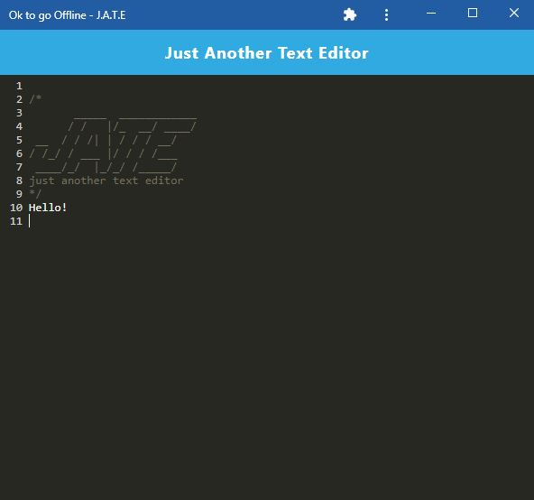

# JATE - OfflineNotes
  

  ## Description
  
  - This is my first progressive web application, PWA. It's a single-page text editor/note taker app that runs in the browser. It features a number of data persistence techniques that serve as redundancy in case one of the options is not supported by the browser. The app can be downloaded and function offline!
  - To build the application, I started with an existing non-PWA application and implemented methods for getting and storing data to an IndexedDB database.
    
    
  The following is a screenshot of the downloaded application.   

    
   
   
  ## Table of Contents
   
  - [Installation](#installation)
  - [Usage](#usage)
  - [Credits](#credits)
  - [License](#license)
  - [How To Contribute](#how_to_contribute)
  - [Tests](#tests)
  - [Questions](#questions)
  
  ## Installation
  
  To install the application:
  1) Have [NODE.js](https://nodejs.org/en/download/) installed on your computer. 
  2) Clone my [GitHub](https://github.com/CM-GDev/OfflineNotes) repo for this application.
  3) From the root of your project folder and from the command-line, run "npm install" to install the required npm packages for the application
  4) Next run "npm run start:dev" to have the application run live on your local computer and have the option to download the app
  
  ## Usage
  
  I have also deployed the full-stack application to Heroku, [JATE](https://heroku)   
    
  ## Credits

  For this homework assignment, I relied on the Mozilla documentation for [PWAs](https://developer.mozilla.org/en-US/docs/Web/Progressive_web_apps)  
  
  ## License
  
  MIT License

  Copyright (c) [2022] [Cristobal Marquez-Glynn]
  
  ## How to Contribute
  
  - [Contributor Covenant](https://www.contributor-covenant.org/) 
  - I'm open to suggestions on how to improve this product.
  
  ## Tests
  
  N/A
  
  ## Questions
   
  For any questions, you can reach me through my [GITHUB](https://github.com/CM-GDev) or email: cristobalmqz@gmail.com account. 
